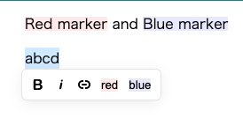

Fork from [editor-js/marker](https://github.com/editor-js/marker).

Create custom marker.



## Usage
Install.

```
yarn add editor-js-custom-marker
```

and setting

```js
const editor = new EditorJS({
  autofocus: true,
  tools: {
    redMarker: CustomMarker("赤", "#ffecec", "bg-red", "span"),
    blueMarker: CustomMarker("青", "#ececff", "bg-blue", "span"),
    redFontMarker: CustomMarker("赤", "#bb0000", "red", "span", true), // font color
  },
});
```
